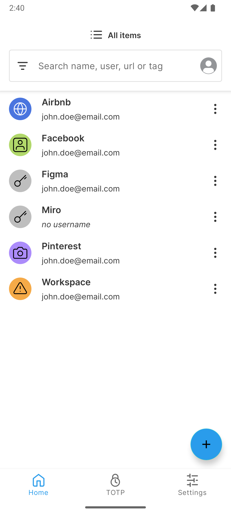
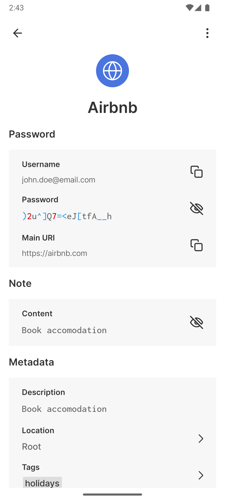
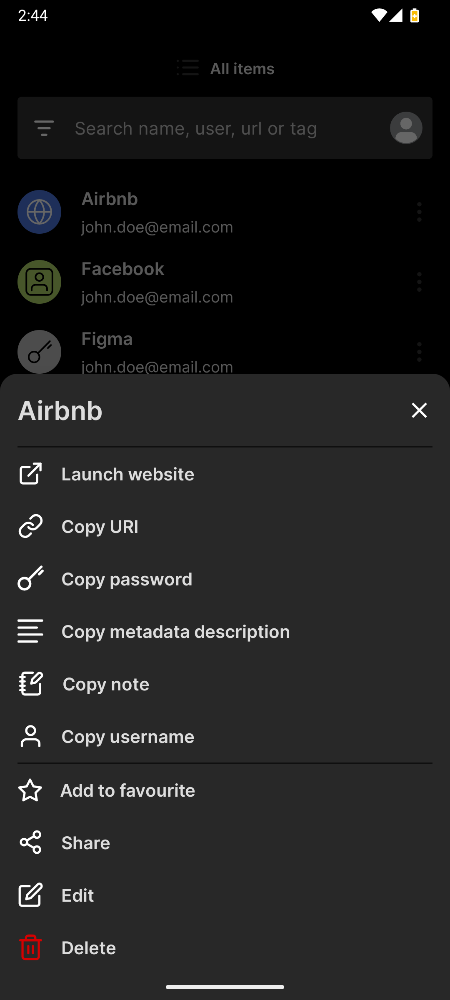

	      ____                  __          ____
	     / __ \____  _____ ____/ /_  ____  / / /_
	    / /_/ / __ `/ ___/ ___/ __ \/ __ \/ / __/
	   / ____/ /_/ (__  |__  ) /_/ / /_/ / / /_
	  /_/    \__,_/____/____/_.___/\____/_/\__/

	Open source password manager for teams
	(c) 2026 Passbolt SA
	https://www.passbolt.com

# Welcome

## License

Passbolt - Open source password manager for teams

(c) 2026 Passbolt SA

This program is free software: you can redistribute it and/or modify it under the terms of the GNU Affero General
Public License (AGPL) as published by the Free Software Foundation version 3.

The name "Passbolt" is a registered trademark of Passbolt SA, and Passbolt SA hereby declines to grant a trademark
license to "Passbolt" pursuant to the GNU Affero General Public License version 3 Section 7(e), without a separate
agreement with Passbolt SA.

This program is distributed in the hope that it will be useful, but WITHOUT ANY WARRANTY; without even the implied
warranty of MERCHANTABILITY or FITNESS FOR A PARTICULAR PURPOSE. See GNU Affero General Public License for more details.

You should have received a copy of the GNU Affero General Public License along with this program. If not,
see [GNU Affero General Public License v3](http://www.gnu.org/licenses/agpl-3.0.html).

## About passbolt

Passbolt is an open source password manager for teams. It allows to securely share and store credentials. For instance, the wifi password of your office, or the administrator password of a router, or your organisation social media account password, all of them can be secured using Passbolt.

You can try a demo of passbolt at [passbolt.com](https://demo.passbolt.com).

You can find step by step quickstart guides for all the clients in the [website help section](https://www.passbolt.com/docs/user/quickstart/).

Or, of course, you can use the code in this repository to build it yourself and run it!

## About passbolt Android app

The Passbolt Android app gives you secure access to your passwords on the go. Your private key is stored safely in the Android Keystore, and you can unlock it quickly using biometrics instead of typing your passphrase every time. Once unlocked, the app can autofill your credentials directly into other apps and websites — strong security, now in your pocket.

## What does it look like?

## Reporting a security Issue

If you've found a security related issue in Passbolt, please don't open an issue on GitHub. Follow our responsible disclosure process: https://www.passbolt.com/docs/contribute/security/vulnerability/.

# For developers

## Building with Android Studio (recommended)

1. Launch [Android Studio](https://developer.android.com/studio) and open the cloned project
2. Make sure that Android SDK with version `30` is installed to compile the project
3. Wait until project configuration finishes (couple of minutes) and click `Sync with Gradle files` icon (top right toolbar - elephant
   with blue arrow)
4. Open the `Build Variants` tab (bottom left vertical pane) and under the `:app` module select `Active Build Variant` as `debug`
5. Prepare a device for launch - at minimum `Android 10 (API 30)` is required
    1. [create and launch Android emulator](https://developer.android.com/studio/run/managing-avds) **or**
    2. [set up and launch on a real device](https://developer.android.com/studio/run/device)
6. Hit the `Run` arrow (green play icon in the top center)

## Building without Android Studio

1. Download [Android build tools](https://developer.android.com/studio#downloads) - scroll to `Command line tools only`
2. Using the downloaded command line
   tools [install the build tools](https://developer.android.com/studio/command-line/sdkmanager#install_packages) for `API 30` required
   to compile the project
3. Open terminal and navigate to cloned project root directory
4. Use [Gradle Wrapper](https://docs.gradle.org/current/userguide/gradle_wrapper.html) to build the project from
   terminal `./gradlew assembleDebug` (during first build the Wrapper will also download and setup Gradle if not present) - the built
   application will be available at `{project-dir}/app/build/outputs/apk/debug`
5. To install on a connected device (see above section 4.1 or 4.2) execute `./gradlew installDebug`

## How to run verifications locally

1. Navigate to project root directory
2. Execute `./gradlew detekt ktlint lintDebug unitTest licenseeRelease dependencyUpdates buildHealth`

You can also run each check individually if needed:

* `detekt` and `ktlint` - run static analysis for kotlin
* `lintRelease` - run Android linter
* `unitTest` - execute all unit tests
* `licenseeRelease` - check if all dependencies have appropriate licenses
* `dependencyUpdates` - check if any dependencies have updates in the release channel
* `buildHealth` - produce a report about unused dependencies or incorrect dependency declaration
* `createAggregatedCoverageReport` - generate aggregated unit test and instrumented test coverage report

To execute Android instrumented tests connect your device and execute:
`./gradlew connectedAndroidTest`
Note for instrumented tests run a set of environment variables with test user must be set on the machine that builds the application:

* `PASSBOLT_TEST_USERNAME` - ID of the user on the server
* `PASSBOLT_TEST_USER_ID` - username of the user on the server
* `PASSBOLT_TEST_DOMAIN` - server domain
* `PASSBOLT_TEST_FIRST_NAME` - first name of the user
* `PASSBOLT_TEST_LAST_NAME` - last name of the user
* `PASSBOLT_TEST_AVATAR_URL` - URL of the user avatar (optional)
* `PASSBOLT_TEST_KEY_FINGERPRINT` - user's key fingerprint
* `PASSBOLT_TEST_ARMORED_KEY_BASE_64` - base64 of user's armored key
* `PASSBOLT_TEST_PASSPHRASE` - user's key passphrase
* `PASSBOLT_TEST_LOCAL_USER_UUID` - a random uuid

## How to run instrumented tests locally

For running instrumented tests there we set
up [Gradle managed devices](https://developer.android.com/studio/test/gradle-managed-devices) for consistent results.
Please use:

* `./gradlew pixel5@targetSdkautomatedTestsAndroidTest` to run all the tests or
* `./gradlew pixel5@targetSdkautomatedTestsAndroidTest -Pandroid.testInstrumentationRunnerArguments.class={_packege_class}` to run
  specific class tests.
* `./gradlew pixel5@targetSdkautomatedTestsAndroidTest -Pandroid.testInstrumentationRunnerArguments.class={_packege_class}#{_method}` to run
  specific test.

# Credits

https://www.passbolt.com/credits
